# **Introdução ao Docker e Comandos Linux**  
**Nome:** Daniel Braga    
**Data:** [09/05/2025]  

---

## **1. Introdução**  
🔹 **Objetivo do exercício:**  
 Realizar exercícios práticos com comandos básicos do Linux em um contêiner Docker baseado no Fedora.
---

## **2. Relato das Atividades**  

### **2.1. Iniciar um contêiner Fedora**  
- Download da imagem e execução do contêiner interativo  
**Figura 1:** Saída do comando `docker run`.  
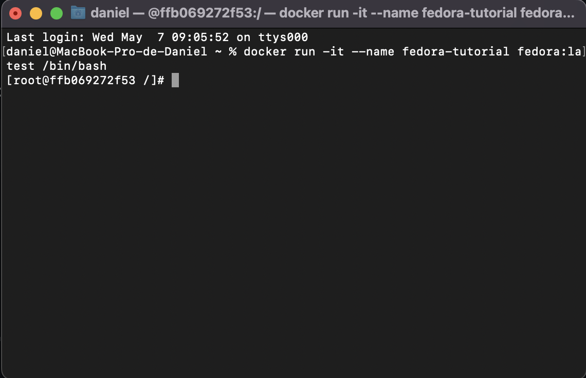 

---

### **2.2. Navegação básica**  
- Comandos: `pwd`, `cd ~`, `ls`, `mkdir`, `cd`  
**Figura 2:** Resultado da navegação entre diretórios.  
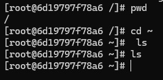
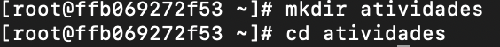  

---

### **2.3. Manipulação de arquivos**  
- Criação, renomeação, cópia e exclusão de arquivos  
**Figura 3:** Estrutura de arquivos antes/depois das operações.  
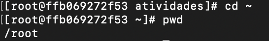

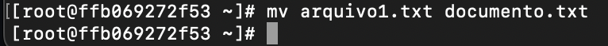
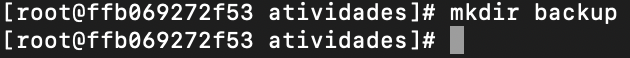
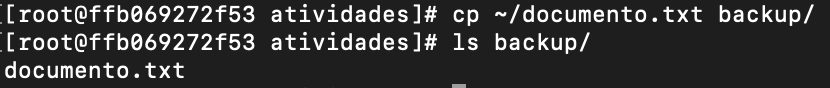
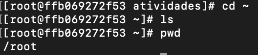
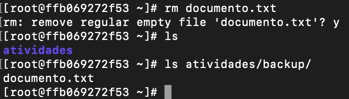

---

### **2.4. Gerenciamento de pacotes**  
- Instalação e remoção do `nano` com `dnf`  
**Figura 4:** Saída dos comandos `dnf install` e `dnf remove`.  
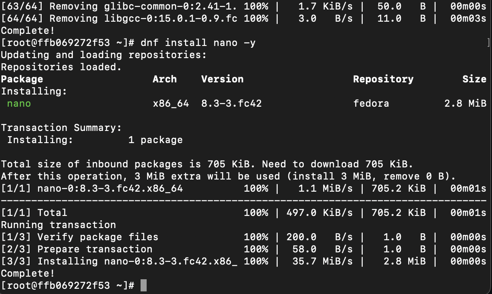
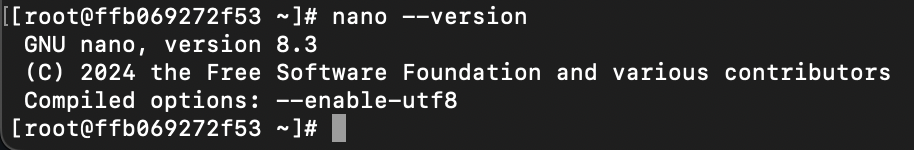
  

---

### **2.5. Permissões de arquivos**  
- Uso do `chmod` para alterar permissões  
**Figura 5:** Comparação antes/depois do `chmod u+x`.  
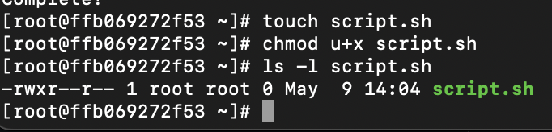  

---

### **2.6. Processos em execução**  
- Comandos `ps aux`, `sleep` e `kill`  
**Figura 6:** Listagem e encerramento de processos.  
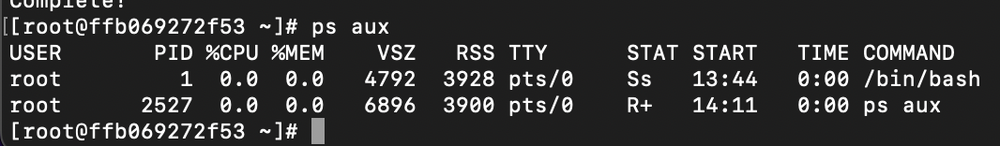
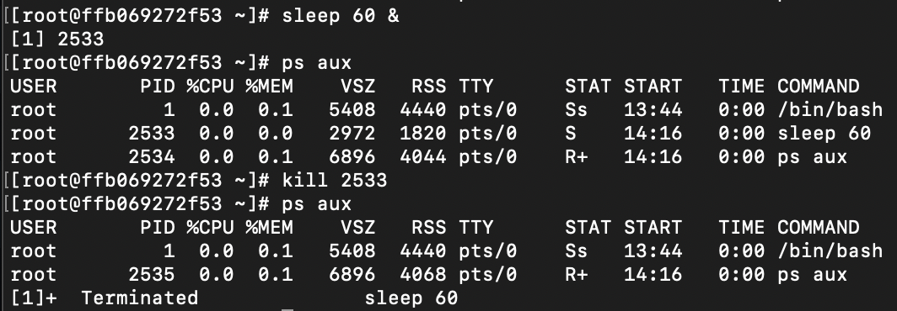  
---

### **2.7. Encerrando o contêiner**  
- Saída e remoção do contêiner  
**Figura 7:** Confirmação da remoção com `docker rm`.  
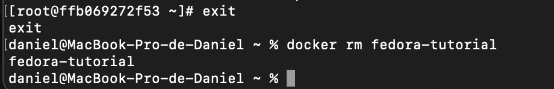

---

## **3. Conclusão**  
🔹 **Aprendizados:**  
- Aprendi os comandos basicos de linux sobre os tópicos apresentados  

🔹 **Dificuldades:**  
- Memorização da funcionalidade de cada código  

🔹 **Observações finais:**  
 Sugiro fazer as atividades com um objetivo claro para entendermos melhor os comandos
